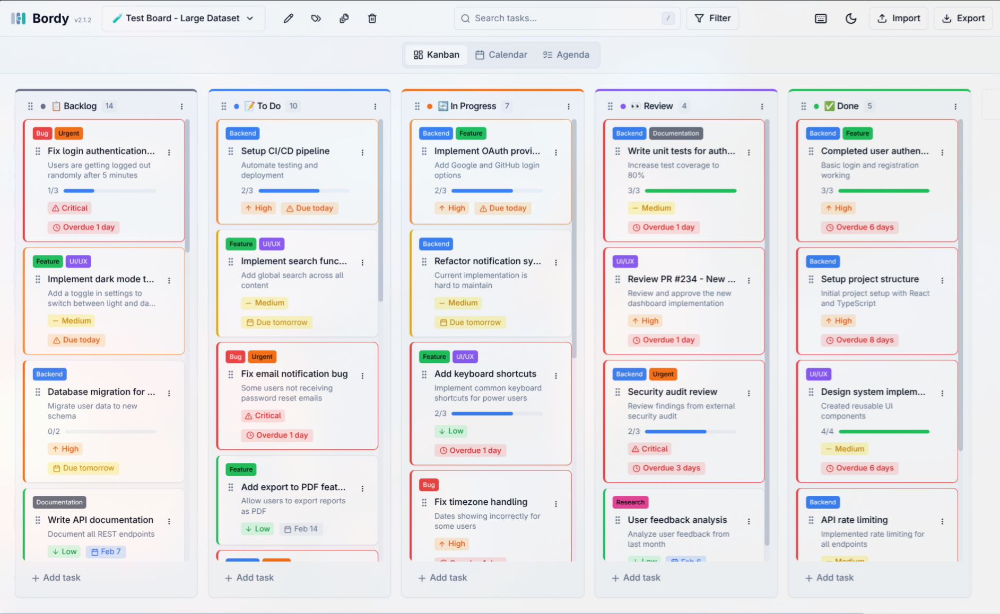
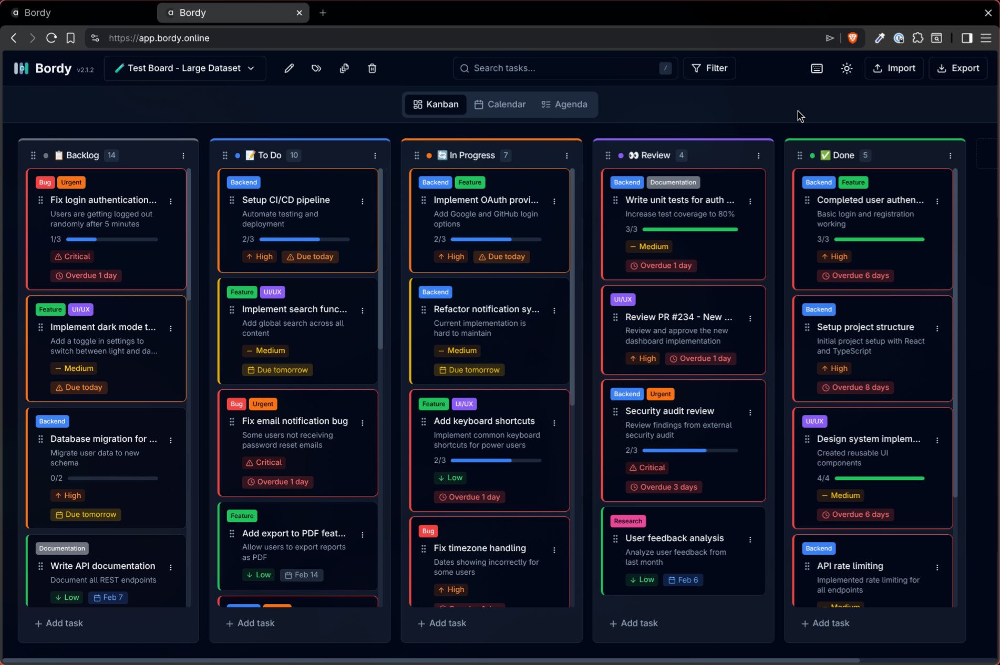
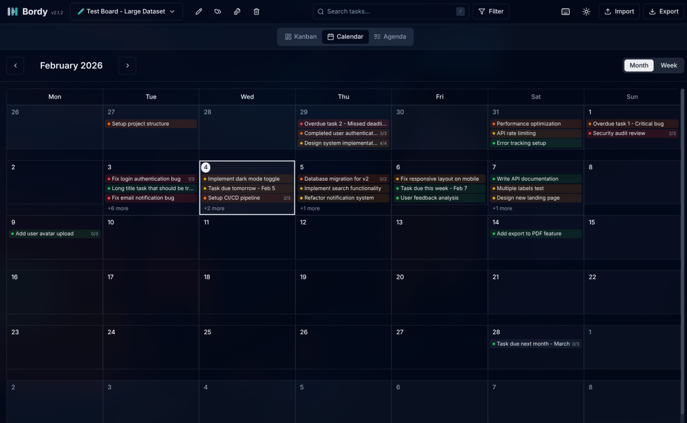
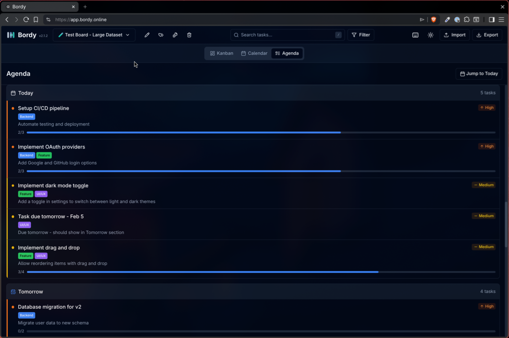

<p align="center">
  
</p>

# Bordy
A simple, fast, and privacy-focused Kanban board application. All data is stored locally in your browser using IndexedDB - no server, no account required.


[](CHANGELOG.md)

## ✨ Features

- **Multiple Boards** - Create and manage multiple Kanban boards
- **Board Templates** - Start quickly with built-in templates or create your own
- **Drag & Drop** - Intuitive drag and drop for tasks and columns
- **🎨 Column Colors** - Color-code your columns for better visual organization
- **Labels/Tags** - Organize tasks with colored labels
- **Due Dates** - Set and track task deadlines with visual indicators
- **🚨 Task Priority** - Set priority levels (Critical, High, Medium, Low) with visual indicators
- **🔍 Search & Filter** - Find tasks quickly by title, description, labels, priority, or due date
- **✅ Subtasks/Checklists** - Break down tasks into smaller items with progress tracking
- **⌨️ Keyboard Shortcuts** - Navigate and create tasks without touching the mouse
- **📅 Calendar View** - View tasks in month or week calendar format with drag & drop date change
- **📋 Agenda View** - See tasks grouped by date (Overdue, Today, Tomorrow, This Week, Later)
- **💬 Task Comments** - Add notes and comments to tasks with edit/delete and timestamps
- **Dark/Light Theme** - Switch between themes based on your preference
- **Import/Export** - Backup and restore your data as JSON with toast notifications
- **📎 Attachments** - Attach images and files to tasks (up to 10MB per file)
- **100% Local Storage** - Your data never leaves your browser
- **💻 Responsive Layout** - Centered views with max-width on large screens
- **No Account Required** - Start using immediately, no sign-up needed

## 📅 View Modes

Bordy supports three view modes for managing your tasks:


### Responsive Centering
All views are optimized for large screens:
- **Kanban**: Columns automatically center when they fit; horizontal scroll when they don't
- **Calendar**: Max-width 1400px, centered
- **Agenda**: Max-width 900px, centered
### Kanban View (Default)
The classic board/column layout with drag & drop task management.

### Calendar View
View your tasks in a calendar format:
- **Month View** - See the entire month at a glance
- **Week View** - More detailed view of the current week
- **Drag & Drop** - Drag tasks between days to change due dates
- **Quick Add** - Click on any day to quickly add a task
- **Task Preview** - Click "+X more" to see all tasks for a day

### Agenda View
A list-based view organized by due date:
- **Overdue** - Tasks past their due date
- **Today** - Tasks due today
- **Tomorrow** - Tasks due tomorrow
- **This Week** - Tasks due within the current week
- **Later** - Tasks with future due dates
- **No Date** - Tasks without a due date (collapsible)

**Switching Views:**
- Use the view switcher below the header
- Press `V` to cycle through views
- Calendar shortcuts: `T` (today), `M` (month), `W` (week), `[`/`]` (prev/next)

## 🎨 Column Colors

Columns can be color-coded for better visual organization:

- **10 predefined colors** - Red, Orange, Yellow, Green, Blue, Purple, Pink, Cyan, Gray, or None
- **Visual indicator** - Colored top border (4px) on column cards
- **Color dot** - Small color indicator next to column title
- **Template support** - Built-in templates come with pre-configured column colors

**How to set column color:**
1. Click the column menu (⋮)
2. Select "Edit"
3. Choose a color from the color picker
4. Click "Save"

## 🚨 Task Priority

Tasks can be assigned one of 5 priority levels:

| Priority | Color | Use Case |
|----------|-------|----------|
| 🔴 Critical | Red | Urgent issues requiring immediate attention |
| 🟠 High | Orange | Important tasks to complete soon |
| 🟡 Medium | Yellow | Standard priority tasks |
| 🟢 Low | Green | Tasks that can wait |
| ⚪ None | Gray | No priority set |

**Visual indicators:**
- Colored left border on task cards
- Priority badge with icon
- Filter by priority in the filter dropdown

## ⌨️ Keyboard Shortcuts

Bordy supports keyboard shortcuts for faster navigation and task management:

### Global Shortcuts
| Shortcut | Action |
|----------|--------|
| `←` / `→` | Switch between boards |
| `1` - `9` | Quick access to board 1-9 |
| `/` | Focus search |
| `N` | Create new task (in first column) |
| `B` | Create new board |
| `D` | Toggle dark/light theme |
| `V` | Cycle view mode (Kanban → Calendar → Agenda) |
| `?` | Show keyboard shortcuts help |
| `Escape` | Close current dialog |

### Calendar View Shortcuts
| Shortcut | Action |
|----------|--------|
| `T` | Go to today |
| `M` | Switch to month view |
| `W` | Switch to week view |
| `[` | Previous month/week |
| `]` | Next month/week |

> **Tip:** Press `?` anytime to see all available shortcuts!

## 🛠️ Tech Stack

- [React](https://react.dev/) - UI library
- [TypeScript](https://www.typescriptlang.org/) - Type safety
- [Tailwind CSS](https://tailwindcss.com/) - Styling
- [shadcn/ui](https://ui.shadcn.com/) - UI components
- [Jest](https://jestjs.io/) + [React Testing Library](https://testing-library.com/) - Unit tests
- [Playwright](https://playwright.dev/) - E2E tests
- [@dnd-kit](https://dndkit.com/) - Drag and drop
- [idb](https://github.com/jakearchibald/idb) - IndexedDB wrapper

## 📸 Screenshots








## 🚀 Getting Started

### Prerequisites

- Node.js 18+ 
- npm or yarn

### Installation

1. Clone the repository
   ```bash
   git clone https://github.com/yourusername/bordy.git
   cd bordy
   ```

2. Install dependencies
   ```bash
   npm install
   ```

3. Start the development server
   ```bash
   npm start
   ```

4. Open [http://localhost:3000](http://localhost:3000) in your browser

### Build for Production

```bash
npm run build
```

The build output will be in the `build/` folder, ready to be deployed to any static hosting service.

## 📁 Project Structure

```
src/
├── components/
│   ├── ui/                  # shadcn/ui components (+ toast)
│   ├── views/               # View mode components
│   │   ├── ViewSwitcher.tsx     # View mode tabs
│   │   ├── CalendarView.tsx     # Calendar wrapper with DnD
│   │   ├── CalendarMonthView.tsx
│   │   ├── CalendarWeekView.tsx
│   │   ├── CalendarDayCell.tsx
│   │   ├── CalendarTaskItem.tsx
│   │   ├── AgendaView.tsx       # Agenda list view
│   │   └── TaskDetailDialog.tsx # Shared task detail dialog
│   ├── Header.tsx           # App header with board management
│   ├── KanbanBoard.tsx      # Main board component
│   ├── KanbanColumn.tsx     # Column component with color support
│   ├── TaskCard.tsx         # Task card with drag & drop
│   ├── ColorPicker.tsx      # Reusable color picker component
│   ├── LabelBadge.tsx       # Label display component
│   ├── LabelManager.tsx     # Label management dialog
│   ├── PriorityBadge.tsx    # Priority badge component
│   ├── PrioritySelect.tsx   # Priority dropdown selector
│   ├── SearchBar.tsx        # Search input with debounce
│   ├── FilterDropdown.tsx   # Filter by labels, priority & due date
│   ├── ActiveFilters.tsx    # Active filter badges display
│   ├── SubtaskProgress.tsx  # Subtask progress bar
│   ├── CommentList.tsx      # Task comments list with add form
│   ├── CommentItem.tsx      # Single comment with edit/delete
│   ├── SubtaskList.tsx      # Subtask checklist component
│   ├── TemplatePicker.tsx   # Template selection component
│   ├── TemplateManager.tsx  # Template management dialog
│   └── ShortcutsHelpDialog.tsx  # Keyboard shortcuts help
├── hooks/
│   ├── useKanban.ts         # Board, column, task, subtask & label logic
│   ├── useCalendar.ts       # Calendar state & navigation
│   ├── useTemplates.ts      # Template management logic
│   ├── useTaskFilter.ts     # Search & filter logic (incl. priority)
│   ├── useTheme.ts          # Theme management
│   └── useKeyboardShortcuts.ts  # Keyboard shortcuts logic
├── lib/
│   ├── db.ts                # IndexedDB setup (v7)
│   ├── calendar-utils.ts    # Date helper functions
│   ├── templates.ts         # Built-in board templates with colors
│   └── utils.ts             # Utility functions
├── types/
│   └── index.ts             # TypeScript interfaces
└── index.css                # Tailwind & global styles
e2e/                         # Playwright E2E tests
├── board.spec.ts
├── task.spec.ts
├── views.spec.ts
├── attachments.spec.ts
└── export-import.spec.ts
```

## ✅ Subtasks / Checklists

Tasks can have subtasks (checklist items):

- **Click on a task card** to open the detail view
- **Check/uncheck items** directly in the detail view
- **Progress indicator** shows completion (e.g., "3/5")
- **Progress bar** with color coding (blue = in progress, green = complete)
- **Edit mode** allows adding, editing, and deleting subtask items

## 🔍 Search & Filter

Bordy includes powerful search and filter capabilities:

- **Search** - Search tasks by title or description (with debounce)
- **Filter by Labels** - Multi-select labels (OR logic)
- **Filter by Priority** - Filter by Critical, High, Medium, Low, or None
- **Filter by Due Date** - Overdue, Today, This Week, No Date
- **Keyboard Shortcut** - Press `/` to focus search
- **Persistence** - Filters are saved per board in localStorage

## 📋 Built-in Templates

Bordy comes with 9 ready-to-use templates (all with column colors!):

| Template | Description |
|----------|-------------|
| 📋 Blank Board | Start fresh with empty columns |
| 🚀 Demo Board | Sample board with tasks to explore features |
| 🎯 Project Management | Track project tasks from planning to completion |
| 🏃 Agile Sprint | Manage sprints with user stories and tasks |
| 📢 Marketing Campaign | Plan and track marketing activities |
| 📝 Content Calendar | Manage content creation workflow |
| 👥 Hiring Pipeline | Track candidates through hiring process |
| 🏠 Personal Tasks | Organize your daily life |
| 🐛 Bug Tracker | Track and resolve software bugs |

You can also **save any board as a custom template** for reuse!

## 🧪 Testing

Bordy has comprehensive test coverage with both unit and E2E tests.

### Unit Tests (Jest + React Testing Library)

```bash
npm test              # Run in watch mode
npm run test:ci       # Run once (CI mode)
npm run test:coverage # Run with coverage report
```

Unit tests cover:
- IndexedDB operations (`db.test.ts`)
- Type helpers and utilities (`types.test.ts`)
- Calendar utilities (`calendar-utils.test.ts`)
- Attachment validation (`attachments.test.ts`)

### E2E Tests (Playwright)

```bash
npm run test:e2e        # Run headless
npm run test:e2e:ui     # Run with Playwright UI
npm run test:e2e:headed # Run in headed browser
```

E2E tests cover:
- Board management (create, switch, shortcuts)
- Task operations (CRUD, drag & drop, priority)
- View modes (Kanban, Calendar, Agenda)
- Attachments (upload, delete, display)
- Export/Import functionality

**Browsers:** Chromium, Firefox (WebKit on CI only)


## 📊 Data Format

Export/Import uses JSON format (version 2.1.1):

```json
{
  "version": "2.1.1",
  "exportedAt": 1704067200000,
  "boards": [...],
  "columns": [
    {
      "id": "...",
      "title": "To Do",
      "color": "#3b82f6",
      ...
    }
  ],
  "tasks": [
    {
      "id": "...",
      "title": "Task name",
      "priority": "high",
      "comments": [...],
      "subtasks": [...],
      "dueDate": 1704067200000,
      ...
    }
  ],
  "labels": [...],
  "attachments": [
    {
      "id": "...",
      "taskId": "...",
      "name": "file.pdf",
      "type": "application/pdf",
      "size": 12345,
      "data": "base64..."
    }
  ]
}
```


## 🗺️ Roadmap

- [x] Multiple boards
- [x] Drag & drop tasks and columns
- [x] Labels/Tags system
- [x] Due dates for tasks
- [x] Board templates (built-in)
- [x] Custom template management
- [x] Search and filter (by title, description, labels & due date)
- [x] Subtasks / checklists
- [x] Keyboard shortcuts
- [x] Task priority levels
- [x] Column colors
- [x] Calendar view (Month & Week)
- [x] Agenda view
- [x] Task comments / notes
- [x] Markdown support in comments
- [x] File attachments
- [x] Comprehensive test suite (Jest + Playwright)
- [ ] Notifications / Reminders

## 🤝 Contributing

Contributions are welcome! Please feel free to submit a Pull Request.

1. Fork the repository
2. Create your feature branch (`git checkout -b feature/amazing-feature`)
3. Commit your changes (`git commit -m 'Add some amazing feature'`)
4. Push to the branch (`git push origin feature/amazing-feature`)
5. Open a Pull Request

## 📄 License

This project is licensed under the MIT License - see the [LICENSE](LICENSE) file for details.

## 🙏 Acknowledgments

- [shadcn/ui](https://ui.shadcn.com/) for the beautiful UI components
- [dnd-kit](https://dndkit.com/) for the smooth drag and drop experience
- Built with the help of [Claude Opus 4](https://www.anthropic.com/claude) AI model via [AYETO.ai](https://ayeto.ai) platform
