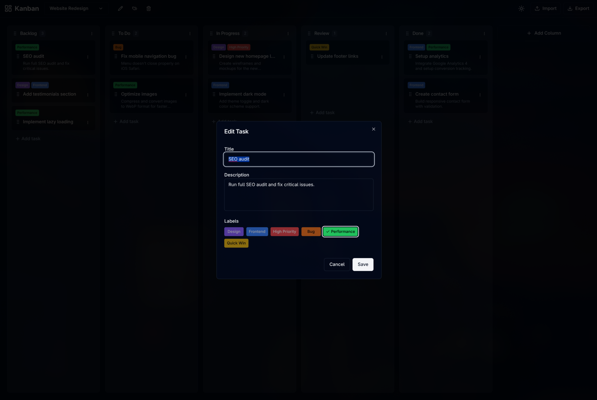

# Bordy

A simple, fast, and privacy-focused Kanban board application. All data is stored locally in your browser using IndexedDB - no server, no account required.


## ✨ Features

- **Multiple Boards** - Create and manage multiple Kanban boards
- **Board Templates** - Start quickly with built-in templates or create your own
- **Drag & Drop** - Intuitive drag and drop for tasks and columns
- **Labels/Tags** - Organize tasks with colored labels
- **Due Dates** - Set and track task deadlines with visual indicators
- **Dark/Light Theme** - Switch between themes based on your preference
- **Import/Export** - Backup and restore your data as JSON
- **100% Local Storage** - Your data never leaves your browser
- **No Account Required** - Start using immediately, no sign-up needed

## 📸 Screenshots




## 🛠️ Tech Stack

- [React](https://react.dev/) - UI library
- [TypeScript](https://www.typescriptlang.org/) - Type safety
- [Tailwind CSS](https://tailwindcss.com/) - Styling
- [shadcn/ui](https://ui.shadcn.com/) - UI components
- [@dnd-kit](https://dndkit.com/) - Drag and drop
- [idb](https://github.com/jakearchibald/idb) - IndexedDB wrapper

## 🚀 Getting Started

### Prerequisites

- Node.js 18+ 
- npm or yarn

### Installation

1. Clone the repository
   ```bash
   git clone https://github.com/yourusername/bordy.git
   cd bordy
   ```

2. Install dependencies
   ```bash
   npm install
   ```

3. Start the development server
   ```bash
   npm start
   ```

4. Open [http://localhost:3000](http://localhost:3000) in your browser

### Build for Production

```bash
npm run build
```

The build output will be in the `build/` folder, ready to be deployed to any static hosting service.

## 📁 Project Structure

```
src/
├── components/
│   ├── ui/                  # shadcn/ui components
│   ├── Header.tsx           # App header with board management
│   ├── KanbanBoard.tsx      # Main board component
│   ├── KanbanColumn.tsx     # Column component
│   ├── TaskCard.tsx         # Task card component
│   ├── LabelBadge.tsx       # Label display component
│   ├── LabelManager.tsx     # Label management dialog
│   ├── TemplatePicker.tsx   # Template selection component
│   └── TemplateManager.tsx  # Template management dialog
├── hooks/
│   ├── useKanban.ts         # Board, column, task & label logic
│   ├── useTemplates.ts      # Template management logic
│   └── useTheme.ts          # Theme management
├── lib/
│   ├── db.ts                # IndexedDB setup
│   ├── templates.ts         # Built-in board templates
│   └── utils.ts             # Utility functions
├── types/
│   └── index.ts             # TypeScript interfaces
├── App.tsx
└── index.css                # Tailwind & global styles
```

## 📋 Built-in Templates

Bordy comes with 8 ready-to-use templates:

| Template | Description |
|----------|-------------|
| 📋 Blank Board | Start fresh with empty columns |
| 🎯 Project Management | Track project tasks from planning to completion |
| 🏃 Agile Sprint | Manage sprints with user stories and tasks |
| 📢 Marketing Campaign | Plan and track marketing activities |
| 📝 Content Calendar | Manage content creation workflow |
| 👥 Hiring Pipeline | Track candidates through hiring process |
| 🏠 Personal Tasks | Organize your daily life |
| 🐛 Bug Tracker | Track and resolve software bugs |

You can also **save any board as a custom template** for reuse!

## 📄 Data Format

Export/Import uses JSON format (version 1.2.0):

```json
{
  "version": "1.2.0",
  "exportedAt": 1704067200000,
  "boards": [...],
  "columns": [...],
  "tasks": [...],
  "labels": [...]
}
```

## 🗺️ Roadmap

- [x] Multiple boards
- [x] Drag & drop tasks and columns
- [x] Labels/Tags system
- [x] Due dates for tasks
- [x] Board templates (built-in)
- [x] Custom template management
- [ ] Search and filter (including by label & due date)
- [ ] Keyboard shortcuts
- [ ] Task comments
- [ ] Subtasks / checklists

## 🤝 Contributing

Contributions are welcome! Please feel free to submit a Pull Request.

1. Fork the repository
2. Create your feature branch (`git checkout -b feature/amazing-feature`)
3. Commit your changes (`git commit -m 'Add some amazing feature'`)
4. Push to the branch (`git push origin feature/amazing-feature`)
5. Open a Pull Request

## 📜 License

This project is licensed under the MIT License - see the [LICENSE](LICENSE) file for details.

## 🙏 Acknowledgments

- [shadcn/ui](https://ui.shadcn.com/) for the beautiful UI components
- [dnd-kit](https://dndkit.com/) for the smooth drag and drop experience
- Built with the help of [Claude Opus 4](https://www.anthropic.com/claude) AI model via [AYETO.ai](https://ayeto.ai) platform
